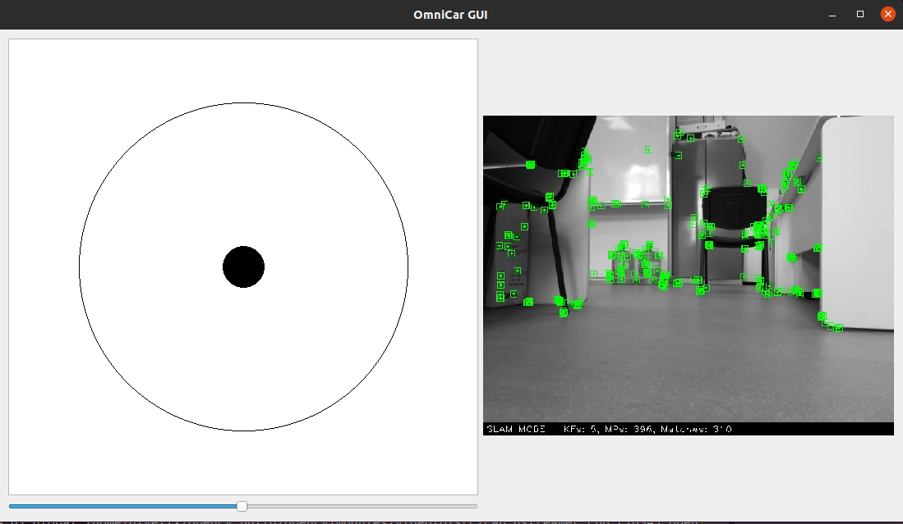
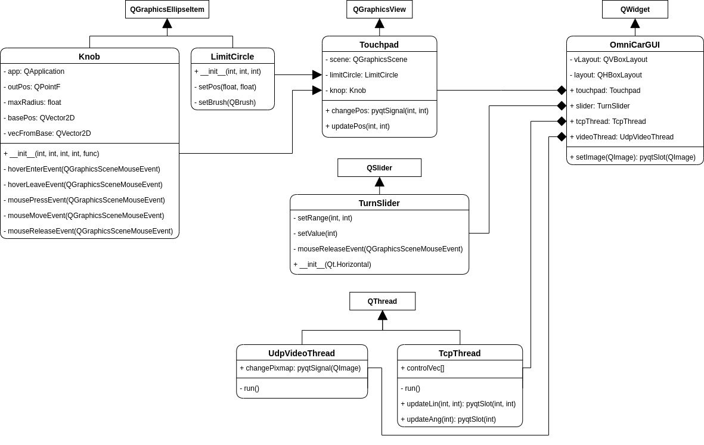

# Introduction
This repository is part of [OmniCar project](https://divelix.github.io/OmniCar/) and responsible for  remote GUI block of the system.

# Showcase
Here you can see how GUI looks in Ubuntu 20.10

# Structure
GUI is being written in Python and uses the following libraries:
* `PyQt5` - draw control widgets and parallelize communication via `QThread`
* `OpenCV` - decode JPEG images that were received from platform
* `socket` - Wi-Fi communication with platform: TCP socket transmits control vector; UDP socket receives video stream

